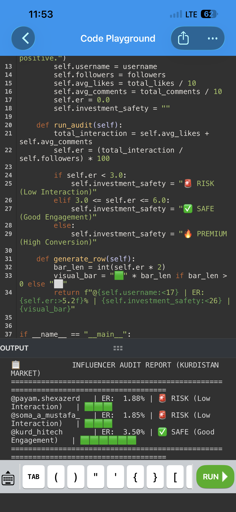

# 📊 Kurdish Influencer Auditor (Kurdistan Market Model)

A modular Python tool designed to audit Instagram creators and public pages in the Kurdistan market. It dynamically calculates the real **Engagement Rate (ER %)** and determines the **Investment Safety Status** for businesses and brands looking to run optimization-driven marketing campaigns.

---

## 🎯 Project Overview
This data science project processes raw profile metrics (Followers, Likes, Comments) across various niches (Tech blogging, Product reviews, Lifestyle vlogging) through a mathematical model to classify accounts into three distinct investment zones:
* **🔥 PREMIUM:** Highly active pages with exceptional conversion potential ($ER > 6\%$).
* **✅ SAFE:** Stable and authentic pages with good community engagement ($3\% \le ER \le 6\%$).
* **🚨 RISK:** Pages with ghost followers, inactive audiences, or low interaction ($ER < 3\%$).

---

## 💻 Tech Stack & Concepts
* **Language:** Python 3.x
* **Core Concepts:** Object-Oriented Programming (OOP), Data Analytics, Modular Architecture, Automation.

---

## 📈 Core Mathematical Formula
The Engagement Rate is calculated dynamically using the standard industry formula implemented within the Python auditor class:

$$\text{Engagement Rate (ER \%)} = \left( \frac{\text{Average Likes} + \text{Average Comments}}{\text{Total Followers}} \right) \times 100$$

---

## 📋 Sample Production Output
When the script executes, it transforms raw metrics from different niches into a structured, easily scannable data grid:

| Username | Account Type | Followers | Avg Likes | Avg Comments | ER % | Safety Status |
| :--- | :--- | :--- | :--- | :--- | :--- | :--- |
| @payam.shexazerd | Lifestyle Blog | 233,000 | 4,229 | 147.6 | 1.88% | 🚨 RISK (Low Interaction) |
| @soma_a_mustafa_ | Product Review | 87,500 | 1,536 | 84.2 | 1.85% | 🚨 RISK (Low Interaction) |
| @kurd_hitech | Tech Review | 66,000 | 2,158 | 150.0 | 3.50% | ✅ SAFE (Good Engagement) |

---

## 🚀 How to Run
You can easily test and run this logic using SoloLearn, Google Colab, or any local Python environment:
1. Open the `main.py` file.
2. Update the input dataset with new account parameters.
3. Click **Run** to generate the real-time evaluation matrix.

_Developed as an open-source tool for localized digital market analysis in Kurdistan._

## Sample Output

